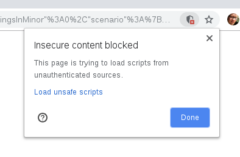

# Demo Game Project

**This is a demo project and just serves as an idea on how to setup a game project.**

## Building and Testing
Install dependencies using `npm install` and run `npm run build` to build files in `dist/` directory.

To test your game on the debug page, edit the `debug.html` file to include a scenario compatible with your game, run a simple local http server in your games directory (e.g. `python3 -m http.server 2080`) and open the `debug.html` at http://localhost:2080/debug.html.

Your browser will probably block the integration of your local game into the https enabled demo site. You need to allow that by clicking on `Load unsafe scripts` as seen in the following screenshot.

## Zig Client
The zig client is included as a dependency in the `package.json` as `zig-js`.
For more information on the zig client, checkout the package documentation
on [npm](https://www.npmjs.com/package/zig-js).
